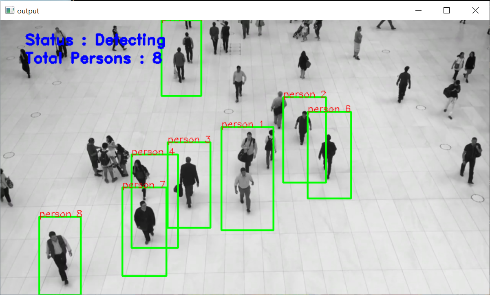

# Human Detection and People Counting with Computer Vision

Prerequisites

The project in Python requires you to have basic knowledge of python programming and the OpenCV library. The below mentioned libraries are required for you to be able to successfully run the program:

OpenCV: A strong library used for machine learning
Imutils: To Image Processing
Numpy: Used for Scientific Computing. Image is stored in a numpy array.
Argparse: Used to give input in command line.

To install the required library, run the following code in your terminal.

pip install opencv-python
pip install imutils
pip install numpy

## Histogram of Oriented Gradient Descriptor

HOG is a feature descriptor used in computer vision and image processing for the purpose of object detection. This is one of the most popular techniques for object detection, to our fortune, OpenCV has already been implemented in an efficient way to combine the HOG Descriptor algorithm with Support Vector Machine or SVM.
Steps To Build Human Detection Project

### 1. Import the libraries:

import cv2
import imutils
import numpy as np
import argparse

### 2. Create a model which will detect Humans:

As discussed earlier, We will use HOGDescriptor with SVM already implemented in OpenCV.  Below code will do this work:

HOGCV = cv2.HOGDescriptor()
HOGCV.setSVMDetector(cv2.HOGDescriptor_getDefaultPeopleDetector())

cv2.HOGDescriptor_getDefaultPeopleDetector() calls the pre-trained model for Human detection of OpenCV and then we will feed our support vector machine with it.

### 3. Detect() method:

Here, the actual magic will happen.

Video: A video combines a sequence of images to form a moving picture. We call these images as Frame. So in general we will detect the person in the frame. And show it one after another that it looks like a video.

That is exactly what our Detect() method will do.  It will take a frame to detect a person in it. Make a box around a person and show the frame..and return the frame with person bounded by a green box.

def detect(frame):
    bounding_box_cordinates, weights =  HOGCV.detectMultiScale(frame, winStride = (4, 4), padding = (8, 8), scale = 1.03)
    
    person = 1
    for x,y,w,h in bounding_box_cordinates:
        cv2.rectangle(frame, (x,y), (x+w,y+h), (0,255,0), 2)
        cv2.putText(frame, f'person {person}', (x,y), cv2.FONT_HERSHEY_SIMPLEX, 0.5, (0,0,255), 1)
        person += 1
    
    cv2.putText(frame, 'Status : Detecting ', (40,40), cv2.FONT_HERSHEY_DUPLEX, 0.8, (255,0,0), 2)
    cv2.putText(frame, f'Total Persons : {person-1}', (40,70), cv2.FONT_HERSHEY_DUPLEX, 0.8, (255,0,0), 2)
    cv2.imshow('output', frame)

    return frame

Everything will be done by detectMultiScale(). It returns 2-tuple.

    List containing Coordinates of bounding Box of person.
    Coordinates are in form X, Y, W, H.
    Where x,y are starting coordinates of box and w, h are width and height of box respectively.
    Confidence Value that it is a person.

Now, We have our detect method. Let’s Create a Detector.

### 4. HumanDetector() method

There are two ways of getting Video.

    Web Camera
    Path of file stored

In this deep learning project, we can take images also. So our method will check if a path is given then search for the video or image in the given path and operate. Otherwise, it will open the webCam.

def humanDetector(args):
    image_path = args["image"]
    video_path = args['video']
    if str(args["camera"]) == 'true' : camera = True 
    else : camera = False

    writer = None
    if args['output'] is not None and image_path is None:
        writer = cv2.VideoWriter(args['output'],cv2.VideoWriter_fourcc(*'MJPG'), 10, (600,600))

    if camera:
        print('[INFO] Opening Web Cam.')
        detectByCamera(ouput_path,writer)
    elif video_path is not None:
        print('[INFO] Opening Video from path.')
        detectByPathVideo(video_path, writer)
    elif image_path is not None:
        print('[INFO] Opening Image from path.')
        detectByPathImage(image_path, args['output'])

### 5. DetectByCamera() method

def detectByCamera(writer):   
    video = cv2.VideoCapture(0)
    print('Detecting people...')

    while True:
        check, frame = video.read()

        frame = detect(frame)
        if writer is not None:
            writer.write(frame)

        key = cv2.waitKey(1)
        if key == ord('q'):
            break

    video.release()
    cv2.destroyAllWindows()

cv2.VideoCapture(0) passing 0 in this function means we want to record from a webcam. video.read() read frame by frame. It returns a check which is True if this was able to read a frame otherwise False.

Now, For each Frame, we will call detect() method. Then we write the frame in our output file.

### 6. DetectByPathVideo() method

This method is very similar to the previous method except we will give a path to the Video. First, we check if the video on the provided path is found or not.

Note – A full path must be given.

def detectByPathVideo(path, writer):

    video = cv2.VideoCapture(path)
    check, frame = video.read()
    if check == False:
        print('Video Not Found. Please Enter a Valid Path (Full path of Video Should be Provided).')
        return

    print('Detecting people...')
    while video.isOpened():
        #check is True if reading was successful 
        check, frame =  video.read()

        if check:
            frame = imutils.resize(frame , width=min(800,frame.shape[1]))
            frame = detect(frame)
            
            if writer is not None:
                writer.write(frame)
            
            key = cv2.waitKey(1)
            if key== ord('q'):
                break
        else:
            break
    video.release()
    cv2.destroyAllWindows()

def detectByCamera(writer):   
    video = cv2.VideoCapture(0)
    print('Detecting people...')

    while True:
        check, frame = video.read()

        frame = detect(frame)
        if writer is not None:
            writer.write(frame)

        key = cv2.waitKey(1)
        if key == ord('q'):
                break

    video.release()
    cv2.destroyAllWindows()

The implementation is similar to the previous function except for each frame we will check that it successfully reads the frame or not. At the end when the frame is not read we will end the loop.

### 7. DetectByPathimage() method

This method is used if a person needs to be detected from an image.

def detectByPathImage(path, output_path):
    image = cv2.imread(path)

    image = imutils.resize(image, width = min(800, image.shape[1])) 

    result_image = detect(image)

    if output_path is not None:
        cv2.imwrite(output_path, result_image)

    cv2.waitKey(0)
    cv2.destroyAllWindows()

### 8. Argparse() method

The function argparse() simply parses and returns as a dictionary the arguments passed through your terminal to our script. There will be Three arguments within the Parser:

    Image: The path to the image file inside your system
    Video: The path to the Video file inside your system
    Camera: A variable that if set to ‘true’ will call the cameraDetect() method.

def argsParser():
    arg_parse = argparse.ArgumentParser()
    arg_parse.add_argument("-v", "--video", default=None, help="path to Video File ")
    arg_parse.add_argument("-i", "--image", default=None, help="path to Image File ")
    arg_parse.add_argument("-c", "--camera", default=False, help="Set true if you want to use the camera.")
    arg_parse.add_argument("-o", "--output", type=str, help="path to optional output video file")
    args = vars(arg_parse.parse_args())

    return args

### 9. Main function

We have reached the end of our project.

if __name__ == "__main__":
    HOGCV = cv2.HOGDescriptor()
    HOGCV.setSVMDetector(cv2.HOGDescriptor_getDefaultPeopleDetector())

    args = argsParser()
    humanDetector(args)

Instead of declaring our model above, we can declare it in our main function.

# Run the Code

## To run the human detection and people counting deep learning code, please run below-mentioned commands as per requirements in Ananconda CMD line interpreter:

### 1. To give video file as input:

python main.py -v ‘Path_to_video’

### 2. To give image file as input:

python main.py -i ‘Path_to-image’

### 3. To use the camera:

python main.py -c True

### 4. To save the output:

Python main.py -c True -o ‘file_name’

## Project Output

